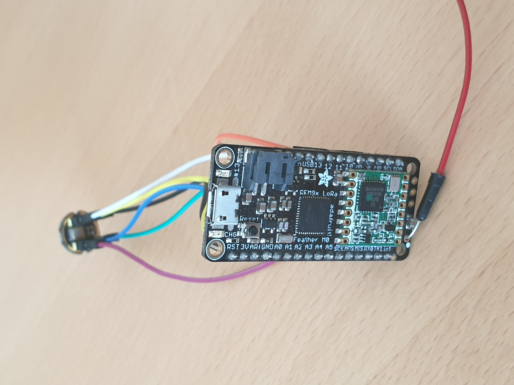
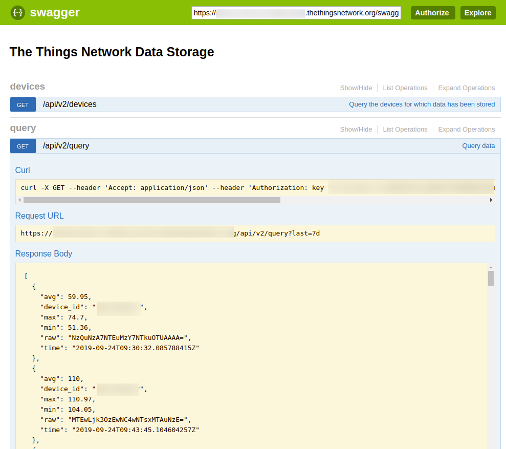
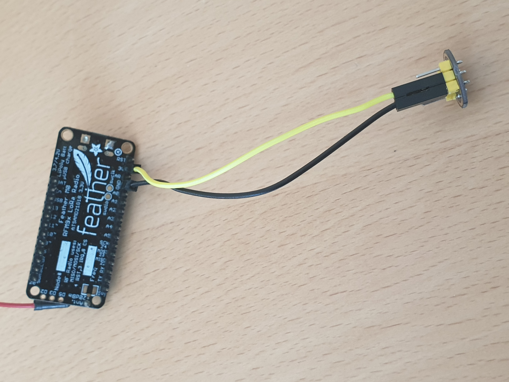
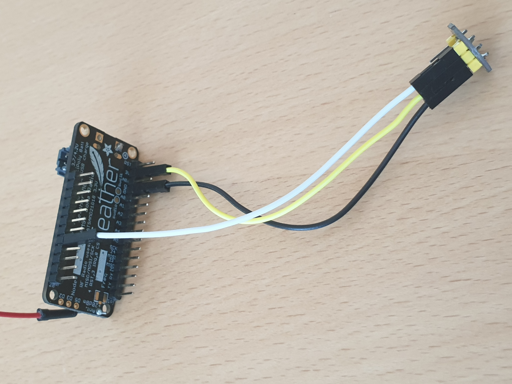
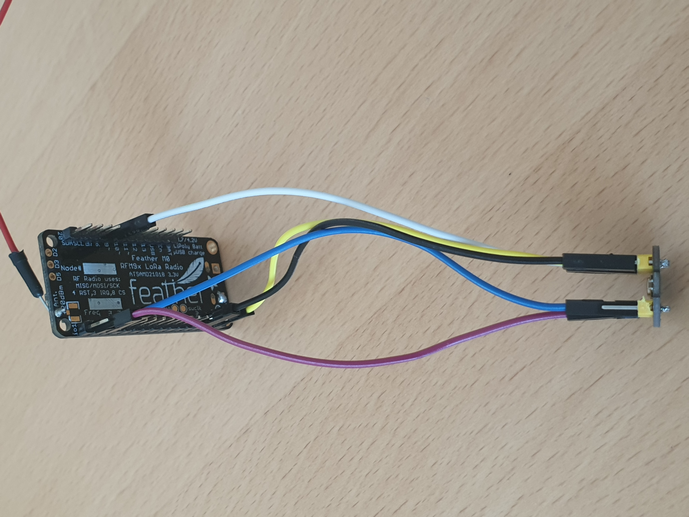
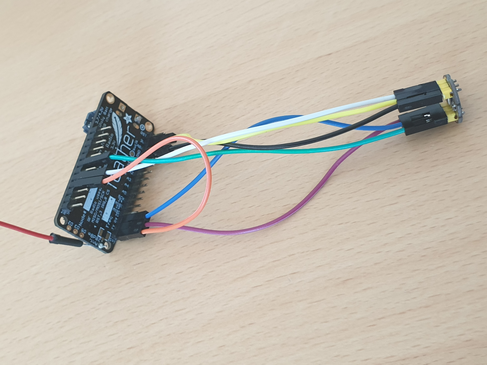
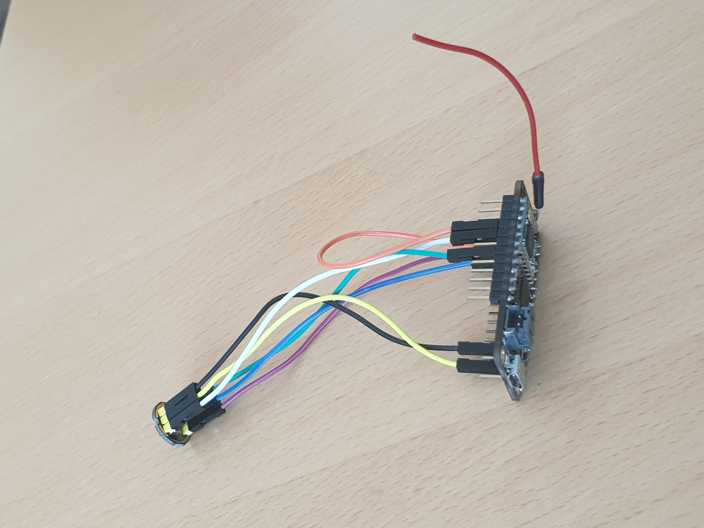
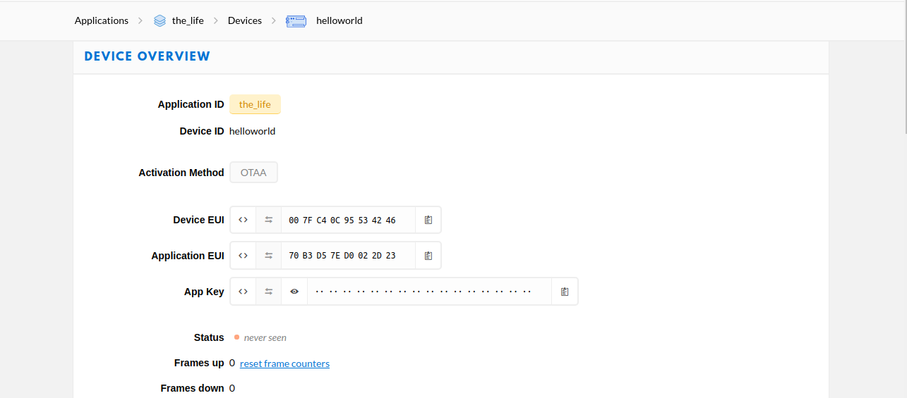
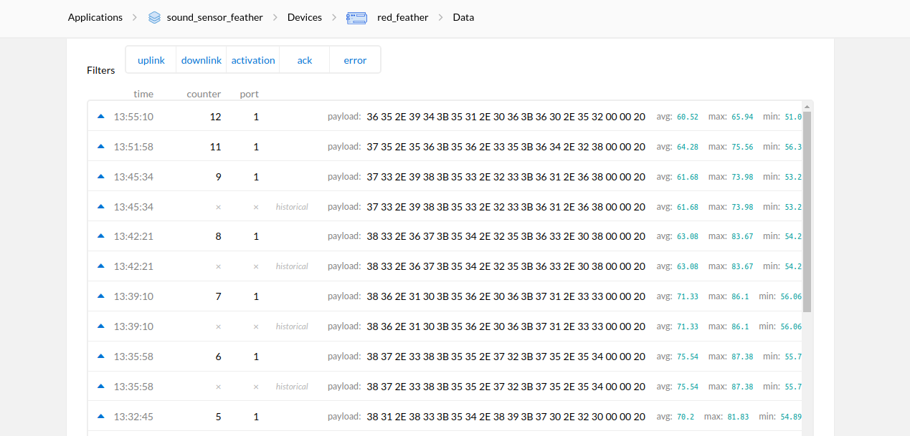

# LoRaWAN Noise Pollution meter (Adafruit Feather M0 + INMP441 + TTN)

This project consists on an Adafruit Feather M0 board that reads data from the INMP441 microphone in order to send the maximum, the average and the minimum sound sample that it listens in a minute. After that, the board will stay in a deep sleep mode for 5 minutes.

## Table of Contents

- [Description](#Description)
- [Hardware](#Hardware)
- [Wiring](#Wiring)
- [Software](#Software)
- [TheThingsNetwork](#TheThingsNetwork)
- [Contributing](#Contributing)
- [ToDo](#ToDo)

## Description

This project is a new idea of how to develop IoT in our global world. The fact that we can listen the environmental sound and transmit it by LoRa pulls up a new and excellent way of communication. The most important reason why we developped this project is that we would like to make what we call a "sound map" over different cities and know which neighbourhoods are noisy or which ones not.

This experiment is based in the use of a board of Adafruit Industries, the Feather M0, that receives data from a microphone based in the I2S communication protocol. This protocol is the most popular one in the world of music, CDs and DVDs, as guitar amplifiers and all those stuff use this protocol for communication between all of them. That's the reason why we took the I2S in our project. 

Our sketch is simple. First of all, we join the board with your The Things Network account. The Things Network is a website (https://www.thethingsnetwork.org/) that hosts your connection by LoRa in order to ease you the way of communicate with your IoT project. After joining TTN the sketch starts to take a measure of the environmental sound each second until it reachs a minute, in that moment the program takes the maximum, the minimum and the average sound and sends it to TTN where you will receive the three data and you can do any kind of integration to keep the results with you, because the TTN page doesn't save the data that receives. 

If you make a bunch of them and you deploy it over the city you will be able to make reality our dream of a **sound map** over a city!! 

## Hardware

For this project I used the following hardware:

* Adafruit Feather M0 with RFM95 LoRa Radio - 900MHz - RadioFruit https://www.adafruit.com/product/3178
* INMP441 microphone https://www.invensense.com/products/digital/inmp441/
* Dupont wires, you can take them anywhere (Amazon, Aliexpress, Bangood,...)

## Wiring

For connecting the Feather to the microphone the following steps should be followed:

* First of all we should connect the VDD and the GND pin of the mic to the 3V and GND pin of the board, respectively:

* Then we connect the pin SD of the mic to pin 9 (digital) of the board

* Later we should connect pin WS and pin SCK to RX0 and TX1, respectively:

* The last step would be connecting pin L/R of the mic to pin 11 (digital), and connect pin 6 to io1, both of them in the board:

This should be the final wiring configuration:

## Software

In this section we detail how to prepare the Arduino IDE for the well compiling and uploading.

#### Boards

The only two group of boards that you need to install are:

* Arduino SAMD boards
* Adafruit SAMD boards

You can find them easily in the Board Manager.

#### Libraries 

* lmic.h: This library and the next one are both used for communication by LoRa. You can get it in: https://github.com/matthijskooijman/arduino-lmic
* hal/hal.h: this library is included in lmic.h
* Adafruit_ZeroI2S.h: This library is used for communication between the microphone and the board. You can get it in Library Manager
* ArduinoLowPower.h: This library is used for giving the board the option of having a deepsleep mode. You can get it in: https://github.com/arduino-libraries/ArduinoLowPower
* RTCZero.h: This library is needed for the well compiling of your program. You can get it in Library Manager

## TheThingsNetwork

For creating an app of TTN you should follow the next steps:

* Go to the console of your profile in TheThings Network (https://www.thethingsnetwork.org/)
* Click in Applications, after that, click in add aplication.
* You will only have to fill the Application ID gap. Select the "add application" button. 
* Your application will be already finished!

For creating a device of TTN you should follow the next steps:

* Once you are in your new application look for register device and click on it.
* You will only need to fill the gap that says Device ID, let the rest of gap to be generated by TTN.
* Click on register device and your device will be registered on your application!

When you have finished the registration of your device you will be able to see this screen:

 

The default communication method in TTN is OTAA. This connection is based in three different numbers you have to give to your board, the DEVEUI, the APPEUI and the APPKEY. These three numbers should be written on your "my_credentials.h" as it says the comments on the sketch.

If you have any doubt click in the next URL (https://www.thethingsnetwork.org/docs/devices/registration.html)

Once you already registered in TTN your device, you are able to send data to TTN and see it in the Data zone, you have to save it. That is for what TTN integration it's used for. The data that you receive will be printed on the screen as it follows:

When you are in the Application site you should click into **integrations**. After that you will click into "Get started by creating one" and you will be able to see lots of integrations that are available for you. There is an integration supplied by TTN whose name is *Data Storage*, it's a free integration that saves your data for a week (7 days) in order to give you a time to pass that information to another place if you want.

When you have access to your integration you can click on *go to platform* and this link will lead you to swagger. Firstly, in this page you will need authorization to see your data. So, click on Authorize and paste your ttn-key. Later on, click on the **GET** button that is located in the *query* header and once you specify the time that you want to display you will be able to see your data and transform it in the format you prefer.

## Contributing

Please contribute using [Github Flow](https://guides.github.com/introduction/flow/). Create a branch, add commits, and [open a pull request](https://github.com/fraction/readme-boilerplate/compare/).

Please note this source code has been released under the GPLv3 terms and all contributions will be considered under the same license. Have a look at the LICENSE file distributed with this code.

## ToDo

#### Measurements inside/outside

Once we had finished our sketch and we where comparing our output data with a registered SPL (this one is what I used: https://www.isweek.com/product/digital-sound-level-meter-gm1356_1590.html), we noticed that when we where in the office (the inside) our measures where quite the same ones as the ones marked by the SPL, it was a good new. But when we took the project to the exterior the measures went wrong. Our sound meter started to return data of 10dB over the measure that gave us the SPL. It will be need to resolve this problem or the project could not be left outside a house or office. 

#### Power supply

An interesting part of IoT consists on making your project self-sufficient, with no need to be checking if is reporting or not and if it's always powered. There is an interesting work to do about the power supply, we tried the JST connector of the board but it started to heat and we are not sure if it's a good option. It's necessary to look for a good power supply that lasts, at least, a month; but we prefer that its own life would be longer, about 3 months.
